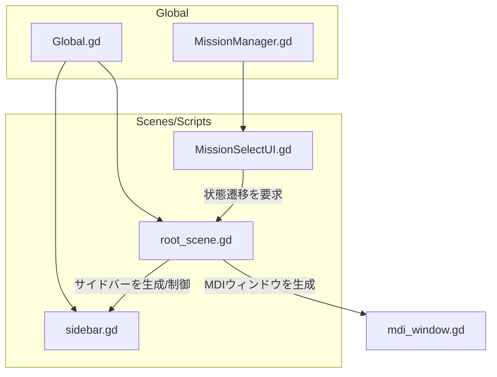

この構成では、**`RootScene.gd`がすべてのUIとゲーム要素の生成・破棄・状態切り替えを統括する中央管理者**としての役割を担っています。

-----

## 🗺️ 1. グローバル設定とデータ管理（シングルトン）

アプリケーション全体で永続的に利用されるデータや定数を保持し、どこからでもアクセス可能です。

| シングルトン / グローバルノード | 役割 | 主な利用シーン/スクリプト |
| :--- | :--- | :--- |
| **`MissionManager.gd`** (AutoLoad) | **ミッションデータ管理**。JSONファイルから全ミッションのメタデータを読み込み、辞書（`loaded_missions`）として保持します。 | `MissionSelectUI.gd` (ミッション一覧の生成) |
| **`Global.gd`** (AutoLoad) | **グローバル定数**の定義。UIの幅やアニメーション時間といった共通の設定値を定義します。 | `root_scene.gd`, `sidebar.gd` (定数の参照) |

-----

## 🔗 2. スクリプト間の主要な依存関係

各スクリプトが**他のスクリプトのデータや関数にアクセスする**依存関係を示します。



-----

## 🔄 3. RootSceneを核としたアプリケーションの状態管理（実行フロー）

メインメニューからミッション実行までの排他的な画面切り替えと、永続要素の制御フローを示します。

### RootSceneの役割（排他的UIの切り替え）

| 関数名 | 実行トリガー | アクション |
| :--- | :--- | :--- |
| **`start_main_menu_mode()`** | アプリ起動時、ミッションから戻る時 | 1. 開いているMDIウィンドウをすべて削除。 2. **`MainMenuUI`** を生成し、`current_ui_instance`に設定。 |
| **`Maps_to_mission_select()`** | `MainMenuUI` の「ミッション開始」ボタン | `switch_full_screen_ui()`を呼び出し、**`MissionSelectUI`** に切り替える。 |
| **`start_mission_from_details(id)`** | `MissionSelectUI` の「スタート」ボタン | 1. `MissionSelectUI`を削除 (`current_ui_instance = null`)。 2. **`Sidebar`** と **`SidebarToggle`** を `visible = true` に。 3. `open_window()`で**MDIウィンドウ**（Terminalなど）を生成し、ゲームモードへ移行。 |

### フロー図

```mermaid
graph TD
	%% 状態
	Start[アプリ起動]
	MMenu[MainMenuUI (排他的)]
	MSel[MissionSelectUI (排他的)]
	Game[ゲームモード (Sidebar + MDI)]
	
	%% RootSceneの制御関数
	R1[RootScene.start_main_menu_mode]
	R2[RootScene.navigate_to_mission_select]
	R3[RootScene.start_mission_from_details]
	R4[RootScene.return_to_main_menu]

	%% 遷移
	Start --> R1
	R1 --> MMenu
	
	MMenu -- ボタン押下 --> R2
	
	R2 --> MSel
	
	MSel -- スタートボタン --> R3
	
	MSel -- 戻るボタン --> R4
	
	R3 --> Game
	
	Game -- ミッション終了/中止 --> R4
	
	R4 --> MMenu
	
	
	style MMenu fill:#FFC,stroke:#000
	style MSel fill:#FFC,stroke:#000
	style Game fill:#FEE,stroke:#000,stroke-dasharray: 5 5
```
